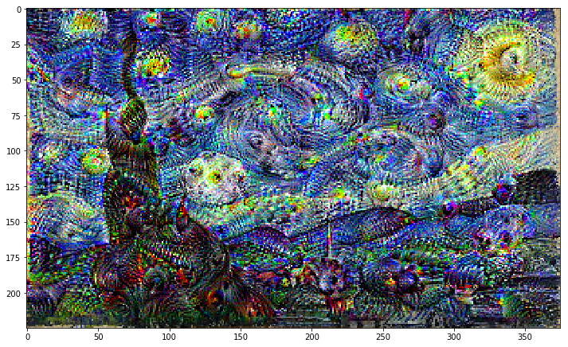

# ART with AI: Using Tensorflow 2.0 and Deep Dream Algorithm


This project creates art using computer vision algorithm created by Alexander Mordvintsev from Google and [Tensorflow](https://www.tensorflow.org) 2.0. 

### Data Reference:

Deep dream is a computer vision algorithm created by Alexander Mordvintsev from Google.
The algorithm works by creating dream-like effect. It’s like giving humans an extremely powerful drug!
When you feed in an image to a trained ANN, the neurons fire and generate activations. The deep dream algorithm work by trying to change the input image in a way that would make some of these neurons fire more (boost the neurons firing or activations).
You can select which neurons in which layer you are interested in making them fire more prominently.
The process is continuously repeated until the input image now contains all features that a specific layer was originally looking for.
Example: if a certain layer was expert in recognizing dog faces and you feed in an image of a blue sky, the deep dream algorithm will continuously change the input image and start creating images of dogs faces on top of the blue sky. The process keep repeating until the layer of interest is happy with the results!
Deep Dream Steps:
Forward an image through a trained ANN, CNN, ResNet..etc
Select a layer of choice (first layers capture edges, deep layers capture full shapes such as faces)
Calculate the activations (output) coming out from the layer of interest.
Calculate the gradient of the activations with respect to the input image
Modify the image to increase these activations, and thus enhance the patterns seen by the network resulting in trippy hallucinated image!
Iterate and repeat over multiple scales
This code is adapted from Tensorflow 2.0 Documentation: https://www.tensorflow.org/beta/tutorials/generative/deepdream


### Step 1: Import TensorFlow and Python Libraries


See more steps in the colab.


### Step 2: Import the dataset

You will need to mount your drive using the following commands:
For more information regarding mounting, please check this out [here](https://stackoverflow.com/questions/46986398/import-data-into-google-colaboratory).


```
from google.colab import drive
drive.mount('/content/drive')
```

See more steps in the colab.


### Step 3: Visualize the dataset using Seaborn, a python library
See more steps in the colab.

### Step 4: Create testing and training data set and clean the data. 
See steps in the colab.

### Step 5: Train the Model. 
See steps in the colab.

### Step 6: Evaluate the Model. 
See steps in the colab.

### Step 7: Improve the Model
If you are not satisfied with the results, then you can increase the number of independent variables and retrain the same model. See steps in the colab.
